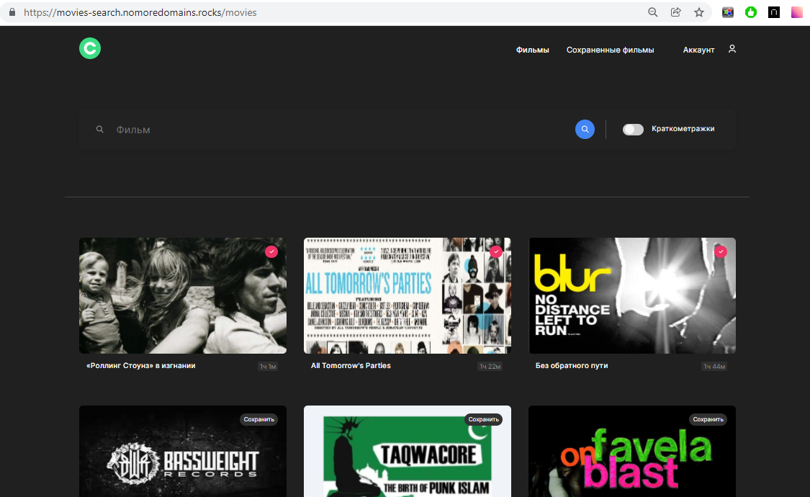

# Фронтенд дипломного проекта Yandex Practicum (fullstack)

**Информация о проекте:**

Сервис, в котором можно зарегистрироваться/залогиниться, найти фильмы по запросу, сохранить их в личном кабинете и удалить оттуда.
На странице профиля, можно отредактировать данные пользователя и выйти из аккаунта.
На стартовой странице информация обо мне, о проекте, обучении.

## Стек технологий:

- Frontend: React js, JSX, CSS-модули, flex, grid, функциональные компоненты, React-hooks, Reactcookie, Адаптивная верстка
- Backend: Express js, Node js, Mongoose, Cookieparser, Cors, nginx, pm2, хэширование пароля, защита роутов проверкой аутентификации токена
- Сервер: запущен и создан на Yandex Cloud;

### Состоит из следующих частей:

- Главная. Содержит информацию о выполненном проекте.
- Страница регистрации. Позволяет пользователю зарегистрировать аккаунт.
- Страница авторизации. На ней пользователь может войти в систему.
- Страница с фильмами. На ней есть форма поиска фильмов и блок с результатами поиска.
- Страница с сохранёнными фильмами. Показывает фильмы, сохранённые пользователем.
- Страница редактирования профиля. Пользователь может изменить данные своего аккаунта.

Ссылка на сайт (деплой проекта): https://movies-search.nomoredomains.rocks

Ссылка на GitHub Бэкенда проекта : https://github.com/ekaanikeeva/movies-explorer-api

Ссылка на макет: https://www.figma.com/file/3f4Qq5vriHkqI2tBMoEY7m/Diploma-Ekaterina-Anikeeva?node-id=932%3A4450
